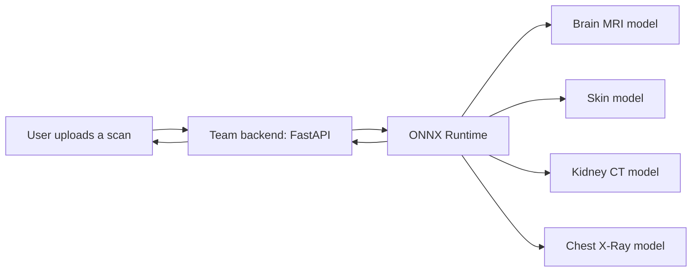

# MediXtract: An Expandable AI Platform for Medical Image Diagnosis

**MediXtract** is a multi-modality medical image screening platform built as a team graduation project at Modern Academy (B.Sc. in Computer Science, May 2026, graded *Excellent with Distinction*).

The platform covers four imaging workflows: **Brain MRI, Skin Dermoscopy, Kidney CT, and Chest X-Ray**. This repository is the home of the **AI / deep learning component**: data preparation, model training, and evaluation.

> **Disclaimer:** MediXtract is a decision-support and research project. It is not a certified medical device and does not replace a diagnosis from a qualified clinician.

## My Role

I worked on the **AI and modelling part** of the project: preparing the data, training and evaluating the deep learning models, and delivering the trained models to the team for integration.

The rest of the platform (backend API, authentication, database, and the bilingual English/Arabic interface) was built by my teammates.

## Results

| Modality | Task | Model | Test accuracy |
|---|---|---|---|
| Brain MRI | 17-class classification | MobileNet | 95.9% |
| Skin Dermoscopy | Classification | MobileNet | 94.9% |

Kidney CT and Chest X-Ray are part of the platform as well. Their detailed results will be added here.

## How the Models Fit into the Platform

The trained models are served through the team's asynchronous FastAPI backend using ONNX Runtime.

## Tech Stack

- **Modelling:** Python, MobileNet (transfer learning / fine-tuning)
- **Deployment format:** ONNX, served with ONNX Runtime
- **Platform (built by the team):** FastAPI backend, bilingual English/Arabic interface

## Repository Status

The repository is being organized. Training notebooks, evaluation results, and exported models will be added, along with dataset sources and reproduction steps. Datasets are not included in the repository.

## Author

**Youssef Abdelaty Abdelalim Mohammed**, Junior AI & Machine Learning Engineer
[GitHub](https://github.com/youssef-abdelaty) | [LinkedIn](https://www.linkedin.com/in/youssef%D9%80abdelaty)

## License

See the [LICENSE](LICENSE) file.
