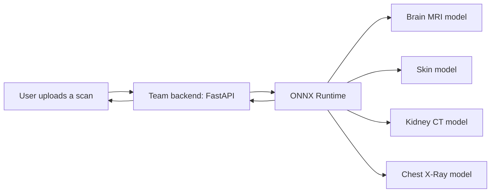

# MediXtract: An Expandable AI Platform for Medical Image Diagnosis

**MediXtract** is a multi-modality medical image screening platform built as a team graduation project at Modern Academy (B.Sc. in Computer Science, May 2026, graded *Excellent with Distinction*).

The platform covers four imaging workflows: **Brain MRI, Skin Dermoscopy, Kidney CT, and Chest X-Ray**. It was designed for underserved communities: results come back in plain language, in Arabic or English, with a confidence score and a "consult a specialist" recommendation. This repository is the home of the **AI / deep learning component**: data preparation, model training, and evaluation.

> **Disclaimer:** MediXtract is a decision-support (CDSS) and research project. It is not a certified medical device and does not replace a diagnosis from a qualified clinician.

## Team

| Member |
|---|
| Youssef Raafat Naguib |
| Youssef Hosny Abdeltwab |
| Youssef Abdelaty Abdelalem |
| Sobhy Fayez Shafek |

## My Role

I worked on the **AI and modelling part** of the project: preparing the data, training and evaluating the deep learning models, and delivering the trained models to the team for integration.

The rest of the platform (backend API, authentication, database, and the bilingual English/Arabic interface) was built by my teammates.

## Results

All figures are on held-out test sets.

| Modality | Task | Model | Dataset | Test accuracy |
|---|---|---|---|---|
| Brain MRI | 17-class classification (tumor type x MRI sequence) | Custom 5-block CNN, trained from scratch | 8,838 images, 70/15/15 stratified split | **95.93%** (macro F1 95.86%, mean AUC 99.89%) |
| Skin Dermoscopy | 7-class lesion classification | MobileNet (ImageNet, two-stage transfer learning) | HAM10000 (10,015 images), lesion-level split | **73.83%** (nevi recall 92.00%, melanoma recall 30.8%) |
| Kidney CT | 4-class: Normal, Cyst, Stone, Tumor | ResNet50 with CLAHE preprocessing | Kaggle CT Kidney (12,446 images), stratified 70/15/15 | **89%** (macro F1 0.87) |
| Chest X-Ray | 4-class: Normal, Pneumonia, COVID-19, Tuberculosis | EfficientNet-B3 (timm, PyTorch) | Class-imbalanced (Pneumonia 3,875 vs COVID-19 460) | **86.77%** with argmax (macro ROC-AUC 0.9889); 92.48% with a tuned NORMAL threshold (optimistic, see notes) |

**Notes on the results**

- The skin model has low sensitivity on melanoma (30.8% recall). It is meant to flag suspicious lesions and prompt specialist consultation, not to rule cancer out.
- The Chest X-Ray NORMAL threshold (0.03) was selected by a grid search evaluated on the test set, so the 92.48% accuracy (macro F1 0.9323) is an optimistic estimate. The 86.77% argmax result is the unbiased baseline. Tuning the threshold on a separate validation set is the proper next step.
- Class imbalance was handled with stratified splits, inverse-frequency class weights (Kidney, Chest, Skin), and class-aware augmentation (Skin).
- Skin and Kidney splits were built to avoid data leakage (lesion-level grouping for HAM10000, fixed seed for Kidney).
- The Chest X-Ray model includes Grad-CAM heatmaps to check that predictions rely on lung fields rather than background artifacts.

## How the Models Fit into the Platform

The trained models are served through the team's asynchronous FastAPI backend (ThreadPoolExecutor for CPU-bound inference) using ONNX Runtime. Inputs are validated, resized to 224x224, and normalized before inference.

## Tech Stack

- **Modelling:** Python, TensorFlow/Keras (Brain, Kidney), PyTorch and timm (Chest)
- **Deployment format:** ONNX, served with ONNX Runtime
- **Platform (built by the team):** FastAPI, PostgreSQL, JWT authentication, vanilla JavaScript bilingual (English/Arabic) interface

## Repository Status

The repository is being organized. Training notebooks, evaluation results, and exported models will be added, along with reproduction steps. Datasets are not included in the repository.

## Author

**Youssef Abdelaty Abdelalem Mohammed**, Junior AI & Machine Learning Engineer
[GitHub](https://github.com/youssef-abdelaty) | [LinkedIn](https://www.linkedin.com/in/youssef%D9%80abdelaty)

## License

See the [LICENSE](LICENSE) file.
